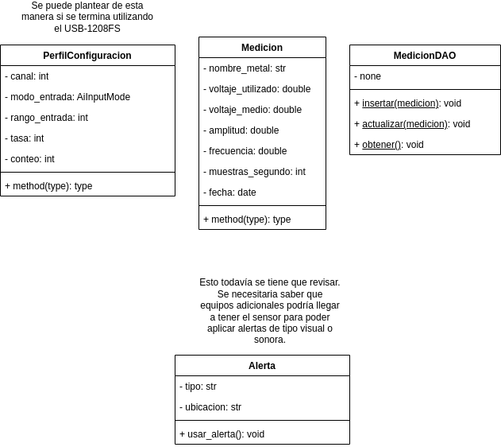
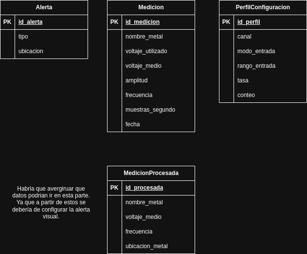

# LSB-Sensor-Induccion-Electromagnetica

----

## Funcionalidades

### Escritorio

- Visualizar mediciones realizadas(base de datos).
- Cargar datos medidos por los detectores.
- Cargar datos a los detectores.
- Crear perfiles de configuración para cada detector.
- Configurar alertas visuales o de sonido en el detector.

### Rasperry 

- Perfiles de configuración
- Lógica para la medición de los metales.
- Cargar datos de la base de datos (Procesados o sin procesar ?)
- Configurar alertas visuales o de sonido en el detector.
----

## Tareas pendiens:

- Desarrollar el modelo medición_procesada.
- Desarrollar el modelo perfil_configuración ?
- desarrollar el modelo alerta ?
- Comenzar con el programa de escritorio.
- Armar la estructura de los JSON utilizados para cargar datos a la Raspberry Pi.
- Verificar y mejorar la lógica en la conexión de la Raspberry Pi con el programa de escritorio.

----

## Modelos

### Raspberry

#### UML



#### Entidad Relación



### Escritorio

#### UML

#### Entidad Relación
---

## Construcción de la base de datos

- Voltaje predeterminado 9 volts.
- Voltaje medio (directamente con el ADC).
- Frecuencia (Podrá ser modificada desde la raspberry?).
- Amplitud.
- Forma de onda.
- Mediciones por segundo (Se penso realizar las mediciones en múltiples hilos).
- Fecha de medición.
- Nombre del metal medido.

## Estructura de carpetas

```
LSB-Sensor-Induccion-Electrogmanetica
|
|─── READNE.md
|
|─── estrictorio_app/
|       |
|       |─── bd/
|       |   |
|       |   |── BaseDatosEscritorio.sqlite3 # Base de datos local del programa de escritorio.
|       |   |
|       |   └── creacion_bd.py
|       |
|       |─── dao/ # Lógica de acceso a los datos de las tablas correspondientes.
|       |   |
|       |   |── medicion_dao.py
|       |   |── medicion_procesada.py
|       |
|       |── modelos/
|       |   |
|       |   |── medicion.py
|       |   |── medicion_procesada.py
|       |   |── alerta.py
|       |   └── perfil_configuracion.py
|       |
|       |── ui/
|       |   |── ventana_alerta.py
|       |   |── ventana_clasificacion.py
|       |   |── ventana_perfil.py
|       |   └── ventana_principal.py
|       |
|       └── utilidades/ # Funciones auxiliares
|           |
|           └── verificar_conexion.py
|
|
|
|─── raspberry_controlador/
|       |
|       |─── bd/
|       |   |
|       |   |── BaseDatosRaspberry.sqlite3 # Base de datos local de la Raspberry Pi (SQLite)
|       |   |
|       |   └── creacion_bd.py
|       |
|       |─── dao/ # Lógica de acceso a los datos de las tablas correspondientes.
|       |   |
|       |   |── alerta_dao.py
|       |   |── medicion_dao.py
|       |   |── medicion_procesada.py
|       |   └── perfil_configuracion_dao.py
|       |
|       |── modelos/
|       |   |
|       |   |── medicion.py
|       |   |── medicion_procesada.py
|       |   |── alerta.py
|       |   └── perfil_configuracion.py
|       |
|       └── utilidades/ # Funciones auxiliares
|           |
|           └── verificar_conexion.py
|
|
└── documentos/ # Diagrmaas, documentación técnica
```

## Guía instalación uldaq (libreria para USB-1208FS)

#### Probar en la Raspberry Pi 400

```bash
sudo apt install libusb-1.0-0-dev build-essential cmake python3-dev
```

```bash
git clone https://github.com/mccdaq/uldaq
```

```bash
cd uldaq
```

```bash
mkdir build && cd build
```

```bash
cmake ..
```

```bash
make
```

```bash
sudo make install
```

#### Para ubuntu

```bash
sudo apt install python3-pip
```

```bash
pip3 --version
```

- Verificar la instalación.

```bash
pip3 install uldaq
```

## Configuración Raspberry Pi 400 como gadget USB serial

```bash
sudo nano /boot/config.txt
```

Agregar al final del archivo:

```bash
dtoverlay=dwc2
```

- Esto habilita el controlador de USB OTG.

```bash
sudo nano /boot/cmline.txt
```

```bash
modules-load=dwc2, g_serial
```
- Agregar despues de `rootwait`(o en cualquier lugar, antes de `quiet`).

```bash
sudo reboot
```

Verificar que el puerto serial aparecio en la Raspberry.

```bash
ls /dev/ttyGS0
```

### Conexión con PC

- Usar un clave USB-C a USB-A.

ejecutar en PC:

#### **Linux**
```bash
dmesg | grep tty
```

Se debería ver:
```bash
[1234.5678] cdc_acm 1-1.3:1.0: ttyACM0: USB ACM device
```

#### **Windows**

- Abrir el **Administrador de dispositivos**.
- Desplegar la sección "**Puertos (COM & LPT)**".

Se debería de ver algo como esto:
```Arduino
USB Serial Device (COM)
```

- El número de COM puede variar.

Para saber el número del puerto(COM):
- Abrir `cmd`

```shell
node
```

- Se debería ver una lista de puertos disponibles.

