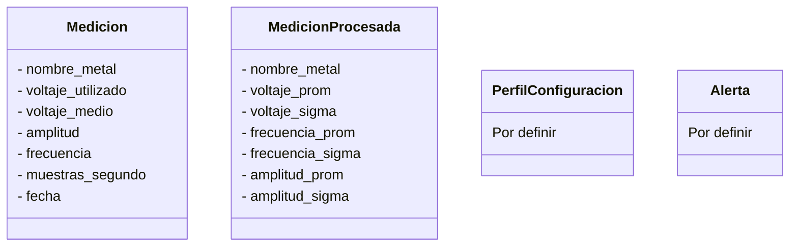
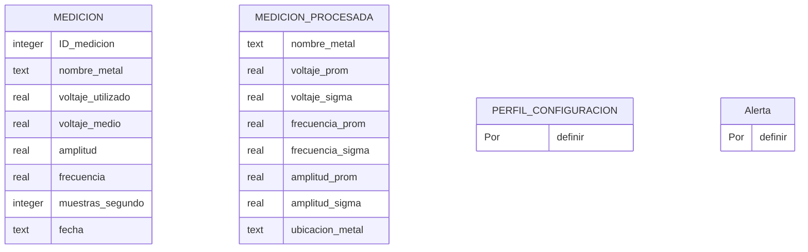

# LSB-Sensor-Inducción-Electromagnética


Proyecto de sensor inductivo experimental basado en una Raspberry Pi 400, diseñado para detectar metales mediante variaciones en un campo electromagnético. El sistema incluye una aplicación embebida para la adquisición y procesamiento de datos, y una aplicación de escritorio para la visualización y análisis de los resultados.


----


## Tabla de Contenidos


### Modelos


#### Clases





#### Bases de datos





---


### Estructura de carpetas


```
LSB-Sensor-Inducción-Electromagnética
|
├── common/                                 # Módulos compartidos entre ambas aplicaciones
│   ├── dao/                                # Acceso a datos de cada tabla
│   │   ├── alerta_dao.py
│   │   ├── medicion_dao.py
│   │   ├── medicion_procesada.py
│   │   └── perfil_configuracion_dao.py
│   │
│   └── modelos/                            # Clases modelo para representar entidades de la base de datos
│       ├── medicion.py
│       ├── medicion_procesada.py
│       ├── alerta.py
│       └── perfil_configuracion.py
│
├── escritorio_app/                        # Aplicación de escritorio (PyQt6)
│   ├── bd/
│   │   ├── BaseDatosEscritorio.sqlite3     # Base de datos local para visualización y procesamiento
│   │   └── creacion_bd.py
│   │
│   ├── ui/                                 # Interfaces gráficas (PyQt6)
│   │   ├── ventana_alerta.py
│   │   ├── ventana_clasificacion.py
│   │   ├── ventana_perfil.py
│   │   └── ventana_principal.py
│   │
│   ├── utilidades/
│   │   └── conexion_wifi_es.py             # Módulo para conexión con la Raspberry vía Wi-Fi
│   │
│   └── main.py                             # Punto de entrada principal de la aplicación
│
├── raspberry_controlador/                  # Controlador embebido que gestiona la detección en la Raspberry Pi
│   ├── bd/
│   │   ├── BaseDatosRaspberry.sqlite3      # Base de datos local del sistema de detección
│   │   └── creacion_bd.py
│   │
│   ├── modulos/
│   │   └── detector.py                     # Módulo encargado de la adquisición, procesamiento y envío de datos
│   │
│   ├── utilidades/
│   │   └── conexion_wifi_rp.py             # Módulo para gestionar la conexión con la app de escritorio
│   │
│   └── main.py                             # Script principal para iniciar el controlador
│
├── documentos/                             # Diagramas y diseño del proyecto
│
└── README.md                               # Instrucciones de instalación y dependencias del proyecto
```


### Instalación


#### Controlador Embebido (Raspberry Pi 400)


```bash
python3 -m venv venv
```
- Se crea un entorno virtual llamado "venv"

```bash
source venv/bin/activate
```
- Activa el entorno virtual

```bash
pip install numpy smbus2
```
- Instala bibliotecas necesarias: NumPy y comunicación I2C

```bash
sudo apt install python3-rpi.gpio
```
- Instala la biblioteca RPi.GPIO para controlar pines de la Raspberry Pi

#### Aplicación de Escritorio (PC)

**Ubuntu/Linux:**

```bash
python3 -m venv venv
```
- Crea un entorno virtual llamado "venv"

```bash
source venv/bin/activate
```
- Activa el entorno virtual (Linux)

```bash
pip install numpy pyqt6 smbus2
```
- Instala bibliotecas necesarias: NumPy, PyQt6 y smbus2

**Windows:**


```cmd
python -m venv venv
```
- Crea un entorno virtual llamado "venv"

```cmd
venv\Scripts\activate.bat
```
- Activa el entorno virtual (Windows CMD)

```cmd
pip install numpy pyqt6 smbus2
```
- Instala bibliotecas necesarias: NumPy, PyQt6 y smbus2

### Ejecución


1. Ejecutar el controlador en Raspberry Pi:


```bash
cd raspberry_controlador
```


```bash
python main.py
```


2. Ejecutar la aplicación de escritorio:


```bash
cd escritorio_app
```


```bash
python main.py
```


### Estado del Proyecto


En desarrollo. Se encuentran implementadas las siguientes funcionalidades:


- Adquisición de señales.
- Comunicación inalámbrica entre dispositivos.
- Base de datos local para almacenamiento histórico.
- Clasificación básica de metales.


Próximos pasos:


- Implementación de perfiles personalizados.
- Gestión de alertas.
- Integración completa y pruebas en campo.

